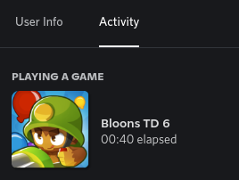
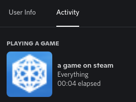
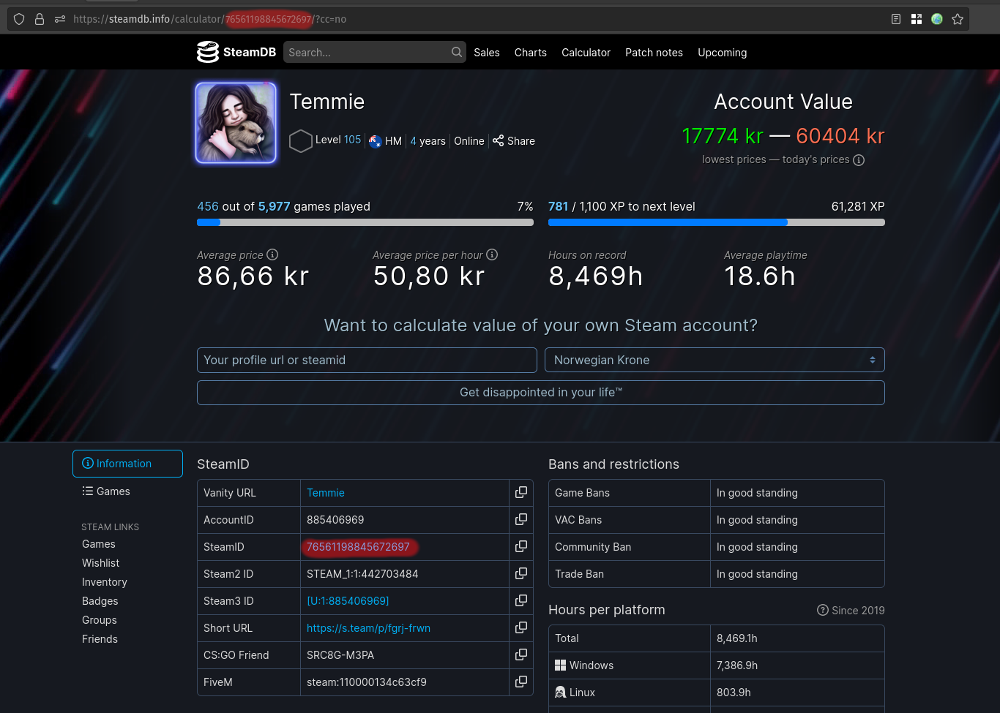

# Steam Presence
a simple script to check a Steam user's current game, and display that as a Discord rich presence

### Showcase


playing "BTD6" with the script running 



playing "Everything" with the script running (more niche game so fetching the game ID thru Discord isn't possible)

### Features

* Set Discord Rich Presence with large image, large image hover text, small image, small image hover text, and start timestamps.
* Automatically fetches game information from steam.
* Supports locally running applications, both games and other programs.
* Supports custom large image cover art, along with text for any game.
* Dynamic config file reloading.

### Why??
well, why did i make this? Discord already detects the games you're playing so isn't this just pointless??

see, no.

Discord has severe limitations when it comes to Linux as most games running thru a compatability layer, and most of these displayed as pr-wrap or something similar.

in addition to this, there's the Steam Deck, a handheld linux game "console".

having discord constantly run in the background is a terrible idea considering how that's gonna lose you at least half an hour of battery life, in addition to the previous issues with linux.

so this script is a way of circumventing these issues by either having this run on something like a server 24/7, or setting this script to start on bootup on your gaming machine.

DO NOTE that if you do intend to run this on a steam deck itself, discord will have to be open in the background

but what this script CAN do is run on as mentioned, a server, or another form of desktop computer (with discord open in the background on that device)

here's a step by step explanation of what happens. Let's say I launch Deep Rock Galactic (rock & stone) on my Steam Deck. Here's what happens:

1) Steam (on my Steam Deck) lets Steam HQ know that I'm running DRG.

2) Steam HQ updates, so my Steam Friends can see that I'm playing DRG.

3) Within a minute, steam-presence (running on my Mac) queries Steam HQ and sees that I'm playing DRG.

4) steam-presence (still on my Mac) pushes the rich presence information to the Discord client (also running on my Mac).

5) The Discord client will now display your current game on your profile, for your friends to see


## Requirements

 - Python 3.8 or higher installed
 - pip installed
 - a verified steam account (requires your account to have spent 5 USD on games) 
 - your steam account must be online in order to detect your current game
 
## Installation

clone the repo:

```sh
git clone https://github.com/JustTemmie/steam-presence
```

follow the **setup** guide

and for linux users, run the [Installer](#installer)

## Setup
create a file named `config.json` in the same directory as main.py and fill it in accordingly.
 
```json
{
    "STEAM_API_KEY": "STEAM_API_KEY",
    "USER_IDS": "USER_ID",

    "DISCORD_APPLICATION_ID": "869994714093465680",
    
    "COVER_ART": {
        "STEAM_GRID_DB": {
            "ENABLED": false,
            "STEAM_GRID_API_KEY": "STEAM_GRID_API_KEY"
        },
        "USE_STEAM_STORE_FALLBACK": true
    },

    "LOCAL_GAMES": {
      "ENABLED": false,
      "LOCAL_DISCORD_APPLICATION_ID": "1062648118375616594",
      "GAMES": [
          "processName1",
          "processName2",
          "processName3",
          "so on"
      ]
    },

    "GAME_OVERWRITE": {
        "ENABLED": false,
        "NAME": "NAME"
    },

    "CUSTOM_ICON": {
        "ENABLED": false,
        "URL": "https://raw.githubusercontent.com/JustTemmie/steam-presence/main/readmeimages/defaulticon.png",
        "TEXT": "Steam Presence on Discord"
    }
}
```
# Steam web API
the `STEAM_API_KEY` in this case is regarding to the Steam web API.

this you can obtain by registering here https://steamcommunity.com/dev/apikey while logged in

# User IDs
the `USER_IDS` is the steam user id of the user you want to track.

**NOTE** this is not the same as the display URL of the user.

the easiest way i've found to get the ID is by throwing your url into the steamDB calculator https://steamdb.info/calculator/

and then taking the ID from that url

(the script will accept multiple IDs, as long as you format them as an array - I.E ["user1", "user2"] and so on)



# Discord Application ID
the `DISCORD_APPLICATION_ID` is the discord application ID of the app you want to use.

please generate one here https://discordapp.com/developers/applications/ or use mine "869994714093465680"

the only thing you need to fill out on their site is the application name itself.

for example i named mine "a game on steam" as shown in the screenshot above.

# Cover Art
and then we have the `COVER_ART` section.

first is the STEAM_GRID_DB subsection
## Steam Grid DB (SGDB)

this will download an icon from steamGridDB and use it as the cover art for the discord presence.

change the ENABLED field to true and fill in the api key enable this.

**NOTE** this is optional and the script functions perfectly without it, you'll just be living with lower quality cover art.

you can get your API key here https://www.steamgriddb.com/profile/preferences/api

additionally, this caches the url to a file named icons.txt, so if you don't like an icon it found you can open the file, find the game, and replace it with any image you want.

## Use Steam Store Fallback 
this will only have an effct if 1) the script fails to fetch an icon from SGDB, or 2) SGDB is simply disabled

what this does is navigate to the store page of your game, and simply uses the 32x32 pixel icon on there, this is fairly low res but it works and is a nice fallback

# Local Games
this will make the script scan for games running locally

## Local Discord App ID

this is the application ID of the app you want to show up whenever you're playing a game that was detected locally

please generate one here https://discordapp.com/developers/applications/ or use mine "1062648118375616594"

the only thing you need to fill out on their site is the application name itself.

for example i simply named mine "a game", rather generic but you can call it whatever

## Games

please fill in the games field according to the names of the tasks, these are not case sensitive

example for unix users:

```
"GAMES": [
    "minesweeper",
    "firefox-bin"
]
```

whilst on windows you need to write something similar to this:

```
"GAMES": [
    "osu!.exe",
    "firefox.exe"
]
```

to find the task names, you can check all your local apps by running `runningApps.py`

you may also set a proper display name inside games.txt

example:

```
firefox-bin=Firefox Web Browser
steam=Steam Store
```

if you want to find out what's running locally, you can run the runningApps.py script, it will simply print out every single application it detects locally, ctrl + f is your best friend. This script is likely going to get improved in the future

# Game Overwrite

if you want to display a game that isn't on steam, you can use the `GAME_OVERWRITE` section.

set enabled to true and fill in the name of the game you want to display.

this will still try to grab an icon from steamGridDB, but if it can't find one you can try giving it one yourself.

# Custom Icon

this is a small icon that appears in the bottom right, enable it or disable it.

set an URL to the image you want to use, and a text that will appear when hovering over the icon.

# Custom Game IDs

if you wish to, you can create a file named "customGameIDs.json", this file will allow the script to properly display the game name for everything.

you need to create a game thru discord's dashboard https://discord.com/developers/applications/ the only thing you need so set is the application name, everything else is irrelevant.

then pair this up with the game's name, be careful with the end of line commas.

note, you will have to make an application thru discord for every single game you add here.

this is compatible with games both fetched thru steam and detected running locally.


template:

```
{
    "Firefox": 1065236154477203456,
    "Godot Engine": 1065241036932268073,
    "Beaver Clicker": 1065249144853254245
}
```

# Python
only tested on python3.8 and higher.

run `python3 -m pip install -r requirements.txt` to install all the dependencies

then run `python3 main.py`

(these should hopefully be platform independent, if they're not please open an issue or pull request)

# Run On Startup
this script doesn't have any inherent way to run when your device starts up.

if you're running either Windows or MacOS i cannot really give you any help with this.

(if you do know a way to run this on startup on any of the mentioned systems, *please* create a pull request with an updated readme)

## Steam Deck / Linux with Systemd

If you have a Steam Deck, it is possible to have steam-presence start automatically when your Steam Deck boots.  This method may also work on other Linux distributions that use per-user Systemd instances.  If you (as a regular user) can run the command `systemctl --user status` successfully, then this should work.

### Installer

simply run the `installer.sh` file

open konsole/another terminal and run this command:

```
./installer.sh
```

### Manual Installation

The file `steam-presence.service` has more information and instructions.

## Linux (not using Systemd)

for those of you not running systemd

create a file named `startup.sh` and paste in the code below, changing the path so it finds the main.py file.

```
screen -dmS steamPresence bash -c 'python3 /home/USER/steam-presence/main.py'
```

make this script executable using `chmod +x startup.sh`

then run `crontab -e` and add `@reboot  /home/USER/startup.sh` to the end of the crontab file.

if you've done these steps the script should launch itself after your computer turns on.

(this ends up using about 30MB of ram)
