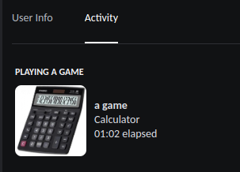

# Steam Presence

a simple script to fetch a Steam user's current game and related info, and display it as a Discord rich presence


Made with ❤ by myself and our contributors

If you have any issues with the script and you can't solve it yourself, don't be ashamed to open an issue! I will typically get back to you within 0-1 days


### Showcase


playing "BTD6" with the script running, discord still finds some of the executables so it appears twice


playing "Snake vs Snake" with the script running

this is pretty much the worst case scenario for the script as it's so niche

* that fetching the game ID thru Discord isn't possible, so it ends up as "a game on steam"
* and there's no art found in any public databases, so it just uses the cover art from steam, which sometimes ends up being a bit cropped



playing a local game i've set up, in this case "calculator", it's not running thru steam, so it's not "a game on steam", but rather just "a game"

### Features

* Set Discord Rich Presence based on information fetched from steam.
* Supports locally running applications, both games and other programs.
* Dynamic config file reloading.
* Simple to set up the core functionality.

if you want a more thorough list, look at some of the [features listed here](#setup)

### Why??
well, why did i make this? Discord already detects the games you're playing so isn't this just pointless??

see, no.

Discord has severe limitations when it comes to Linux as most games running thru a compatability layer, and most of these displayed as pr-wrap or something similar.

in addition to this, there's the Steam Deck, a handheld linux game "console".

having discord constantly run in the background is a terrible idea considering how that's gonna lose you at least half an hour of battery life, in addition to the previous issues with linux.

so this script is a way of circumventing these issues by either having this run on something like a server 24/7, or setting this script to start on bootup on your gaming machine.

DO NOTE that if you do intend to run this on a steam deck itself, discord will have to be open in the background

but what this script CAN do is run on as mentioned, a server, or another form of desktop computer (with discord open in the background on that device)

here's a step by step explanation of what happens. Let's say I launch Deep Rock Galactic (rock & stone) on my Steam Deck. Here's what happens:

1) Steam (on my Steam Deck) lets Steam HQ know that I'm running DRG.

2) Steam HQ updates, so my Steam Friends can see that I'm playing DRG.

3) Within a minute, steam-presence (running on my Mac) queries Steam HQ and sees that I'm playing DRG.

4) steam-presence (still on my Mac) pushes the rich presence information to the Discord client (also running on my Mac).

5) The Discord client will now display your current game on your profile, for your friends to see


## Requirements

 - Python 3.8 or higher installed
 - pip installed
 - a verified steam account (requires your account to have spent 5 USD on games) 
 - your steam account must be online in order to detect your current game
 
## Installation

clone the repo:

```sh
git clone https://github.com/JustTemmie/steam-presence
```

follow the **setup** guide

and for linux users, run the [Installer](#automatic-installer)

## Setup
### Minimal
create a file named `config.json` in the same directory as main.py and fill in the required data:

```json
{
    "STEAM_API_KEY": "STEAM_API_KEY",
    "USER_IDS": "USER_ID"
}
```

instructions for the `STEAM_API_KEY` can be found [here](#steam-web-api)
and the `USER_IDS` field can be found [here](#user-ids)


this will lead to some of the features not being able to work, but it does an alright job,
the script will find:
 - Games running thru steam
 - Art of said games taken from the steam store
 - The rich presence will have the correct name for most games, whilst some nicher titles will be listed as "a game on steam"
 - Fetch rich presence information thru steam, for example in Hades you can be "Battling out of Elysium" or in BTD6 you can be "Browsing Menus"


### Full Featureset
 if you want more of the features provided by this script, you may fill in whatever parts of this config file seem interesting to you.
 this will allow the script functionality such as:
 - [Customizing the default game name to display when the script can't find the correct name (I.E the correct discord ID)](#discord-application-id)
 - [Detection of non-steam games running thru steam (done thru scuffed webscraping)](#non-steam-games)
 - [Usually better art (thru steam-grid-DB)](#steam-grid-db-(sgdb))
 - [The detection of games running locally, such as minecraft (actually not scuffed)](#local-games)
 - [Overwriting it with whatever you want, even when not playing anything](#game-overwrite)
 - [A custom icon in the rich presence](custom-icon)
 - [Manually adding the correct names for any game you'd like](#custom-game-ids)
 - [Disabling fetching steam's rich presence](#fetch-steam-rich-presence)
 - [Enabling steam reviews](#fetch-steam-reviews)
 - [Add a button to the steam store page](#add-steam-store-button)
 - [Ability to blacklist games from showing up on discord rich presence](#blacklist) 

you will still need to fill out the `STEAM_API_KEY` found [here](#steam-web-api) and the `USER_IDS` found [here](#user-ids)

this is what a full config file looks like; you only need to fill in the parts that you want to change for this default
```json
{
    "STEAM_API_KEY": "STEAM_API_KEY",
    "USER_IDS": "USER_ID",

    "DISCORD_APPLICATION_ID": "869994714093465680",

    "FETCH_STEAM_RICH_PRESENCE": true,
    "FETCH_STEAM_REVIEWS": false,
    "ADD_STEAM_STORE_BUTTON": false,

    "WEB_SCRAPE": false,
    
    "COVER_ART": {
        "STEAM_GRID_DB": {
            "ENABLED": false,
            "STEAM_GRID_API_KEY": "STEAM_GRID_API_KEY"
        },
        "USE_STEAM_STORE_FALLBACK": true
    },

    "LOCAL_GAMES": {
      "ENABLED": false,
      "LOCAL_DISCORD_APPLICATION_ID": "1062648118375616594",
      "GAMES": [
          "processName1",
          "processName2",
          "processName3",
          "so on"
      ]
    },

    "GAME_OVERWRITE": {
        "ENABLED": false,
        "NAME": "Breath of the wild, now on steam!",
        "SECONDS_SINCE_START": 0
    },

    "CUSTOM_ICON": {
        "ENABLED": false,
        "URL": "https://raw.githubusercontent.com/JustTemmie/steam-presence/main/readmeimages/defaulticon.png",
        "TEXT": "Steam Presence on Discord"
    },

    "BLACKLIST": [
    	"game1",
    	"game2",
    	"game3"
    ]
}
```
# Steam web API
the `STEAM_API_KEY` in this case is regarding to the Steam web API.

this you can obtain by registering here https://steamcommunity.com/dev/apikey while logged in

the `domain` asked for does not matter in the slightest, just write something like 127.0.0.1 or github.com 

# User IDs
the `USER_IDS` is the steam user id of the user you want to track.

**NOTE** this is not the same as the display URL of the user.

the easiest way i've found to get the ID is by throwing your url into the steamDB calculator https://steamdb.info/calculator/

and then taking the ID from that url


**NOTE 2** the script accepts multiple steam users if you format it as "userid1,userid2" or ["userid1", "userid2"]

# Discord Application ID
the `DISCORD_APPLICATION_ID` is the discord application ID of the app you want to use.

please generate one here https://discordapp.com/developers/applications/ or use mine "869994714093465680"

the only thing you need to fill out on their site is the application name itself.

for example i named mine "a game on steam" as shown in the screenshot above.

# Cover Art
and then we have the `COVER_ART` section.

first is the STEAM_GRID_DB subsection
## Steam Grid DB (SGDB)

this will download an icon from steamGridDB and use it as the cover art for the discord presence.

change the ENABLED field to true and fill in the api key to enable this.

you can get your API key here https://www.steamgriddb.com/profile/preferences/api

### icons.txt
additionally, images from SGDB will be cached to a file named icons.txt, so if you don't like an icon it found you can open the file, find the game, and replace it with any image you want.

basic example:
```
hades=https://cdn2.steamgriddb.com/file/sgdb-cdn/icon/fe50ae64d08d4f8245aaabc55d1baf79/32/80x80.png||Art by DIGGRID on SteamGrid DB
deep rock galactic=https://cdn2.steamgriddb.com/file/sgdb-cdn/icon/fb508ef074ee78a0e58c68be06d8a2eb/32/256x256.png||Art by darklinkpower on SteamGrid DB
a short hike=https://cdn2.steamgriddb.com/file/sgdb-cdn/icon/6a30e32e56fce5cf381895dfe6ca7b6f.png||Art by Julia on SteamGrid DB
risk of rain 2=https://cdn2.steamgriddb.com/file/sgdb-cdn/icon/c4492cbe90fbdbf88a5aec486aa81ed5/32/256x256.png||Art by darklinkpower on SteamGrid DB
```
name of game=link to image||optional text to appear when hovering over


## Use Steam Store Fallback 
this will only have an effect if 1) the script fails to fetch an icon from SGDB, or 2) SGDB is simply disabled

what this does is navigate to the store page of your game, and copy the link directly from the header image there, this image will end up getting cropped so it's not ideal but it works fairly well, at least in my opinion.

# Local Games
this will make the script scan for games running locally

## Local Discord App ID

this is the application ID of the app you want to show up whenever you're playing a game that was detected locally. if you want to, this can be the same as the other default app ID

please generate one here https://discordapp.com/developers/applications/ or use mine "1062648118375616594"

the only thing you need to fill out on their site is the application name itself.

for example i simply named mine "a game", rather generic but you can call it whatever

## Games

please fill in the games field according to the names of the tasks, these are not case sensitive

example for unix users:

```
"GAMES": [
    "minesweeper",
    "firefox-bin"
]
```

whilst on windows you need to write something similar to this:

```
"GAMES": [
    "osu!.exe",
    "firefox.exe"
]
```

to find the task names, you can check all your local apps by running `runningApps.py`

### games.txt

you may also set a proper display name inside games.txt

example:

```
firefox-bin=Firefox Web Browser
steam=Steam Store
```

if you want to find out what's running locally, you can run the runningApps.py script, it will simply print out every single application it detects locally, ctrl + f is your best friend. This script is likely going to get improved in the future


# Fetch Steam Rich Presence


the "enhanced rich presence" info here is talking about the "Browsing Menus" part 

some steam games have what steam calls "enhanced rich presence", it's pretty much the same rich presence system discord has, but on steam!

not a ton of games have this implementet, as i can speak from personal experience as a game dev, it's pretty hard and un-intuitive

fetching this "enhanced rich presence" is enabled by default

but it can be disabled if you like by adding `"FETCH_STEAM_RICH_PRESENCE": false,` to the config file

# Fetch Steam Reviews

the script can also fetch the reviews of any steam game - it's very epic

if you'd like to enable this, add `"FETCH_STEAM_REVIEWS": true,` to the config file

# Add Steam Store Button 

if you want, you can add a button to the steam page, price included (USD)

add `"ADD_STEAM_STORE_BUTTON": true,` to the config file to enable this

# Non Steam Games

okay i'll be frank, this functionality is VERY scuffed, but - it does work.

so for a bit of background to why this was thrown together in such a scuffed manner, the main reason being that Steam's actual API does not report non steam games in ANY capacity.

so the best solution i could come up with to solve this; web scraping - loading a website in the background, reading the data off it, and closing it - redoing this every 20 seconds.

performance wise it's actually fine, being reasonably light weight and on anything reasonably modern this should be fine.

to do this, download your cookies for steam these are needed because the script needs to login as you in order to see what games you're playing (yes it's scuffed).

from my own experience steam's cookies tend to stay valid for about a week, meaning you have to redo this step EVERY week.

download this addon for firefox, i couldn't find any extensions for chrome that i'm certain aren't viruses (sorry, just go download firefox for this).

https://addons.mozilla.org/en-US/firefox/addon/cookies-txt/

navigate to your profile on steam, and download the steam cookie file, naming it "cookies.txt" and save it in the same folder as main.py

then change WEB_SCRAPE in the config file to true

**Note**: due to the names of non steam games being set by yourself, steam grid DB might have problems finding icons for the game, but if it's in their database, this script will fetch it

**Note 2**: if you're using multiple steam users, steam presence will be able to fetch every user who is a friend of the cookie's user via this

# Game Overwrite

if you want to display soemthing else, you can use the `GAME_OVERWRITE` section.

set enabled to true and fill in the name of whatever you want to display.

this will still try to grab an icon from steamGridDB, but if it can't find one you can try giving the game an icon yourself, [see icons.txt](#iconstxt).

this field can be *anything* if you want to be seen playing "eirasdtloawbd", or "Hollow knight: Silksong" you can do so.

(note to self, remove the silksong joke when the game actually releases) 

## Seconds Since Start 

this should be set to 0 most of the time

but if you want to display that you've been playing since 2 hours ago, you can set this 7200 (3600 seconds in an hour * 2 hours)

this sadly won't help you break Discord's cap of 24 hours on rich presences

if you set the game to start in -3600 seconds (or 1 hour) it just display 0:00:00

# Custom Icon

this is a small icon that appears in the bottom right, enable it or disable it.

set the URL for an image you'd like to use, and some text to appear when anyone hovers over the icon.

# Custom Game IDs

if you wish to, you can create a file named "customGameIDs.json", this file will allow the script to properly display the game name for everything the script can't find on it's own.

you need to create a game thru discord's dashboard https://discord.com/developers/applications/ the only thing you need so set is the application name, everything else is irrelevant.

then pair this up with the game's name, be careful with the end of line commas.

note, you will have to make an application thru discord for every single game you add here.

this is compatible with games both fetched thru steam and detected running locally.


template:

```
{
    "Firefox": 1065236154477203456,
    "Godot Engine": 1065241036932268073,
    "Beaver Clicker": 1065249144853254245
}
```

# Blacklist

Here you can add games that are not supposed to show up in Discord's rich presence. please fill in the games field according to the full name of the games, these are not case sensitive.

Example:
```
"BLACKLIST" : [
    "Hades",
    "Deep Rock Galactic",
    "Risk of Rain 2"
]
```


# Python
only tested on python3.8 and higher.

run `python3 -m pip install -r requirements.txt` to install all the dependencies

then run `python3 main.py`

(these should hopefully be platform independent, if they're not please open an issue or pull request)

# Run On Startup
this script doesn't have any inherent way to run when your device starts up.

if you're running either Windows or MacOS i cannot really give you any help with this.

(if you do know a way to run this on startup on any of the mentioned systems, *please* create a pull request with an updated readme)

# Installation to Automatically Start on Bootupt

## Automatic Installer

Steam presence currently only supports automatically starting up on `Linux` and `MacOS`, if you know how to make it start on boot within windows, please make a PR, thanks! 

to install steam presence, simply run the `installer.sh` file

to do this, open konsole or another terminal and run this command:

```
./installer.sh
```

## Manual Installation

The file `steam-presence.service` has more information and instructions on how to install it on linux.

## Linux (not using Systemd)

for those of you not running systemd, you might have cron installed!

if you have cron setup, you can also install the `screen` application, and then create a file named `startup.sh` and paste in the code below, changing the path so it finds steam presence's main.py file.

```
screen -dmS steamPresence bash -c 'python3 /home/USER/steam-presence/main.py'
```

make this script executable using `chmod +x startup.sh`

then run `crontab -e` and add `@reboot  /home/USER/startup.sh` to the end of the crontab file.

if you've done these steps the script should launch itself after your computer turns on.
