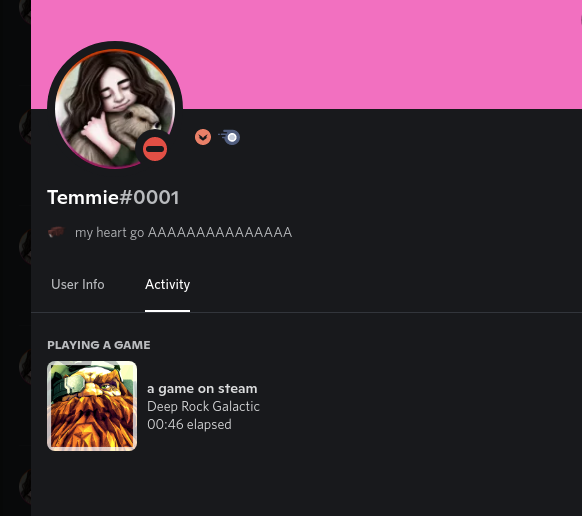

# steam presence on discord
 
 
## Setup
create a file named `config.json` in the same directory as this file and fill it in accordingly.
 
```json
{
    "KEY":  "KEY",
    "USERID": "USERID",

    "DISCORD_APPLICATION_ID": "DISCORD_APPLICATION_ID",

    "COVER_ART": {
        "ENABLED": false,
        "STEAM_GRID_API_KEY": "STEAM_GRID_API_KEY"
    }
}
```
# Steam web API
the `KEY` in this case is regarding to the Steam web API.

this you can obtain by registering here https://steamcommunity.com/dev/apikey while logged in

# User ID
the `USERID` is the steam user id of the user you want to track.

**NOTE** this is not the same as the display URL of the user.

the easiest way i've found to get the ID is by throwing your url into the steamDB calculator https://steamdb.info/calculator/

and then taking the ID from that url

# Discord Application ID
the `DISCORD_APPLICATION_ID` is the discord application ID of the app you want to use.

please generate one here https://discordapp.com/developers/applications/

the only thing you need to fill out on their site is the application name itself.

for example i named mine "on my steam decK" as i'll have this script running on a server and it'll detect my steam deck activity without me running discord on it.

# Cover Art
and then lastly we have the `COVER_ART` section.

this will download an icon from steamGridDB and use it as the cover art for the discord presence.

change the ENABLED field to true and fill in the api key enable this.

**NOTE** this is optional and the script functions perfectly without it, you'll just be missing the cover art.

you can get your API key here https://www.steamgriddb.com/profile/preferences/api

additionally, this caches the url to a file named icons.txt, so if you don't like an icon it found you can replace the url in that file for whatever game.