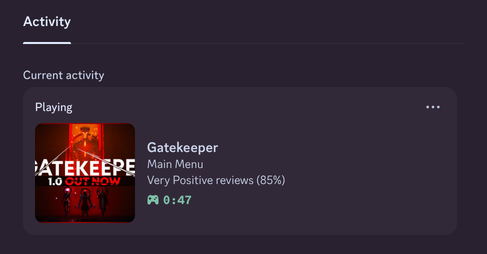
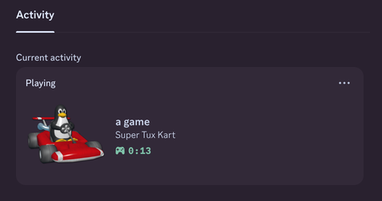

# Steam Presence

A program used to display what you're playing on discord.

## Installation

For installation instructions refer to the [doucumentation](./documentation/installation.md)

## Setup

For setup instructions refer to the [doucumentation](./documentation/setup.md)

## Previews

### Playing a Steam game

### Playing a local game

